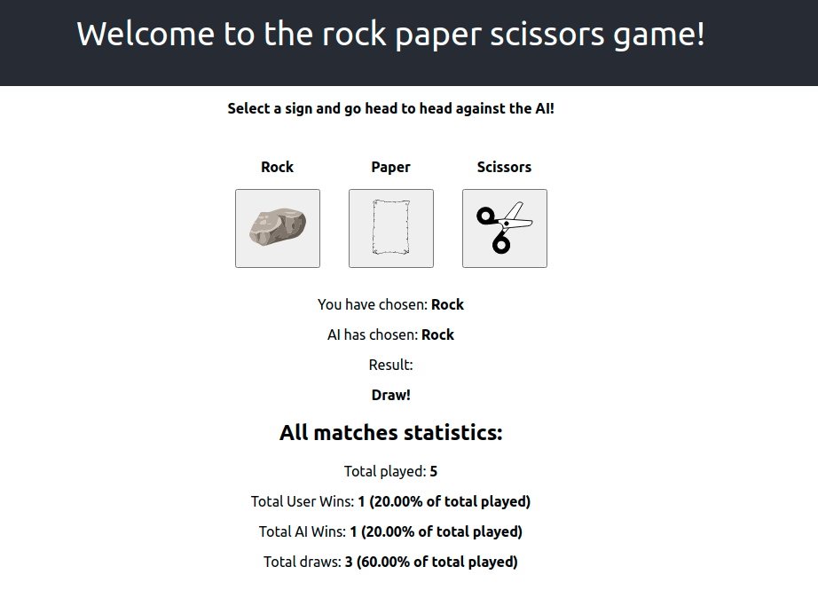

# Rock paper scissors game

An application to simulate a game of rock paper scissors against the AI.



## Running the application

### Production build with nginx

```
sudo docker-compose up --build
``` 

### Development build

```
sudo docker-compose -f docker-compose-dev.yml up --build
```

The application should run on the 3000 port on the local machine. 

For example,

http://localhost:3000